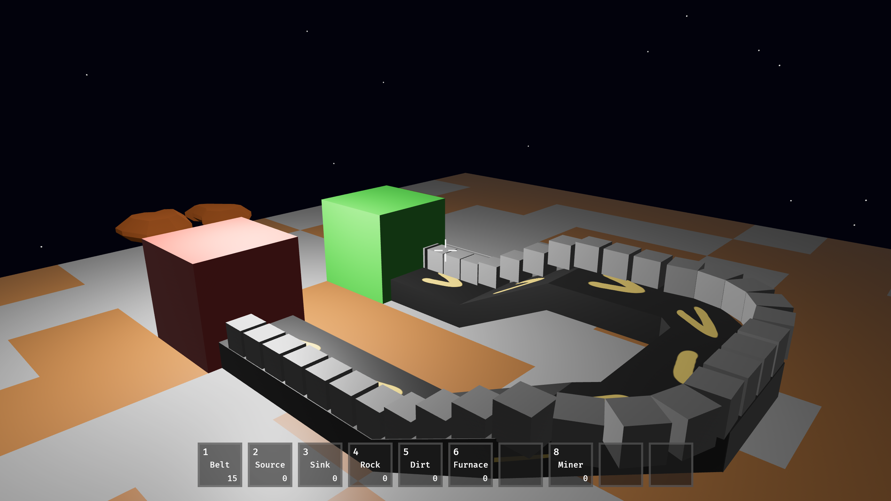

A factory game that combines the order of a mechanical factory with the messiness of the natural world.



https://ui.perfetto.dev/

## Rendering item icons

Item icons are rendered from the `.blend` source files in `blender/` and output to `assets/icons/`.

```
/Applications/Blender.app/Contents/MacOS/Blender --background --python blender/render_icons.py
```

Re-run this any time a `.blend` file is updated. All 3D models and textures referenced by the script live under `blender/`.
